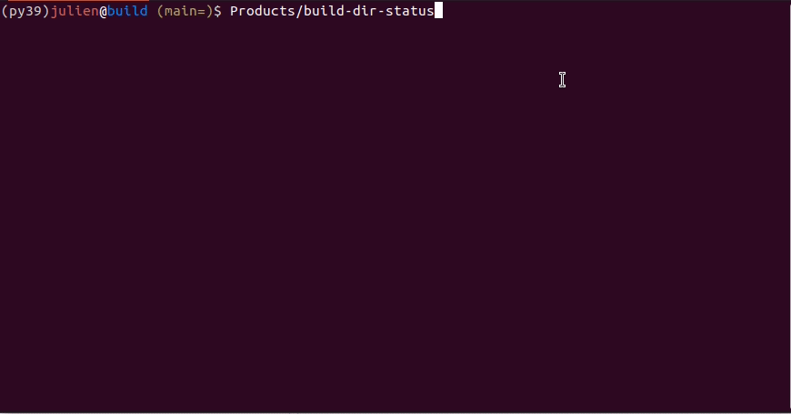

# build-dir-status

[](https://github.com/jmarrec/build-dir-status/actions/workflows/build.yml)
[](https://codecov.io/gh/jmarrec/build-dir-status)
[](https://github.com/jmarrec/build-dir-status/actions/workflows/clang-format-check.yml)
[](https://github.com/jmarrec/build-dir-status/actions/workflows/cppcheck.yml)

My C++ utility using [FTXUI](https://github.com/ArthurSonzogni/FTXUI) to select the build folders I want to refresh (overnight).



I have a `ninja.sh` bash file that I use in all of my C++ build folders and that will output a `.branch` hidden file with the following content:

```
4547_ATUSingleDuctInletSideMixer_DSOA.cde1466a33-Release
start=2022-07-28T15:45+02:00
end=2022-07-28T16:13+02:00
Built branch '4547_ATUSingleDuctInletSideMixer_DSOA' in 28min5s, No tests ran
```

Note: First line is `BRANCH_NAME.SHA-CMAKE_BUILD_TYPE`.

I often want to query the status on these, to see what's really outdated, so I can trigger a rebuild overnight. I have a python script that does the reporting job nicely, but I have no easy way to select the ones I want to rebuild, so I thought this would be a cool project to try out [FTXUI](https://github.com/ArthurSonzogni/FTXUI) in action.

My python one reports for eg this:

```
**** Project1 ******

| Build_dir               | build_type   | branch  | elapsed_time   | SHA         | build_time   | location   |
|:------------------------|:-------------|:--------|:---------------|:------------|:-------------|:-----------|
| Project1-build          | Debug        | branch1 | 00:53          | 63374d4c4e  | 00:04        | home       |
| Project1-build          | Debug        | branch2 | 17:50          | d98628b5f16 | 00:10        | DataExt4   |
| Project1-build-release  | Release      | branch1 | 1 day          | 63374d4c4e  | 00:14        | home       |
| Project1-build-release  | Release      | branch2 | 3 days         | d98628b5f16 | nan          | DataExt4   |


**** Project2 ******

| Build_dir               | build_type   | branch  | elapsed_time   | SHA         | build_time   | location   |
|:------------------------|:-------------|:--------|:---------------|:------------|:-------------|:-----------|
| Project2-build          | Debug        | branch1 | 20:26          | cde1466a33  | 00:25        | home       |
| Project2-build-release  | Release      | branch2 | 20:01          | cde1466a33  | 00:28        | home       |
```

This is a C++ tool that does the same thing: it goes to parse all the .branch files it finds to build a struct of information about that build (cf [BuildDirectory.hpp](src/BuildDirectoryInfo.hpp)), and uses FTXUI to let you select the ones you want.

---

### Notes:

I'm having some trouble running `iwyu` via CMake (some LLVM internal error which makes the build fail), so instead I run locally via:

```shell
mkdir build && cd build
cmake -G Ninja -DCMAKE_BUILD_TYPE:STRING=Debug -DCMAKE_EXPORT_COMPILE_COMMANDS:BOOL=ON ..
iwyu_tool.py -p . -- -Xiwyu --mapping_file=../iwyu.imp
```
